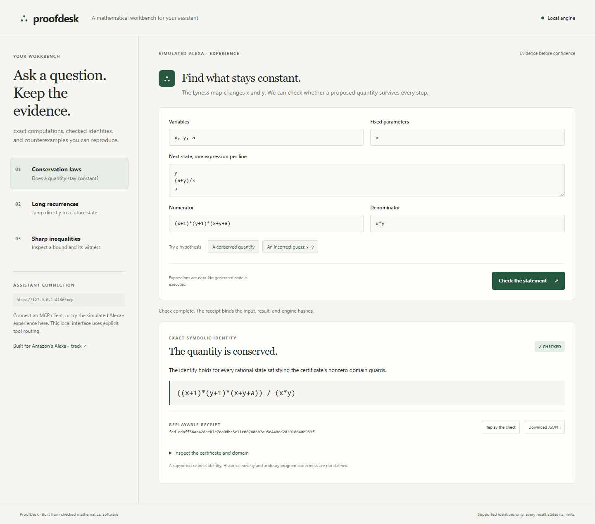

# ProofDesk

**A mathematical assistant should return evidence a person can check.** ProofDesk supplies an MCP server and a working, explicitly simulated Alexa+ interface for exact mathematical questions.



## Try it

Clone this repository or extract the complete test build. Use Python 3.12 or newer from the repository root; there are no third-party runtime dependencies.

```sh
python -B -m proofdesk
```

Open <http://127.0.0.1:4186>. Pick the incorrect `x+y` hypothesis, check it, and inspect the exact counterexample. Check the conserved quantity, then replay and download its receipt. The other workflows compute Fibonacci at `10^30` steps modulo `1000000007` and check a sharp quadratic inequality with an equality witness.

```sh
python -B -m unittest discover -s tests -v
```

Actual acceptance output is retained in [evidence/tests.txt](evidence/tests.txt). [media/demo-local.webm](media/demo-local.webm) records real local interactions. This is a source checkout application; installing an isolated wheel is not the documented execution method.

## Assistant integration

The running server exposes <http://127.0.0.1:4186/mcp> with protocol `2025-11-25`, POST-based Streamable HTTP and JSON responses. It supports `initialize`, `notifications/initialized`, `tools/list`, `tools/call` and `ping`. A server that does not stream may return 405 for GET. Transport acceptance tests exercise actual requests and results; no Alexa production connection or official protocol certification is claimed.

Tools:

| Tool | What it returns |
| --- | --- |
| `check_invariant` | Exact rational identity, domain guards, or an admissible counterexample |
| `recurrence_jump` | Exact modular Fibonacci or affine-recurrence result using its algebraic structure |
| `check_inequality` | A checked certificate for the supported quadratic bound and its equality witness |

An [Agent Skill](agent-skill/SKILL.md) tells an assistant when to use these tools and how to preserve the verdict and domain. Local state binds the input, result and checker hashes into a content-addressed receipt. Replay reconstructs the mathematical obligation; a digest alone is not a proof or digital signature.

## Scope

Expressions are parsed as bounded data. Generated Python is never executed. The checking kernel supports specified rational invariants and a declared sum-of-squares certificate, rather than arbitrary theorems. Recurrence shortcuts apply to the implemented structured families. An invalid certificate is reported as an invalid certificate, without claiming the underlying inequality is false. Parameter-only invariants are labelled trivial.

The local server binds loopback and checks Host/Origin. Deploying a public MCP service requires an authenticated HTTPS deployment and appropriate operational controls. The supplied source/test build works locally without a cloud account.

## What was built for this event

The exact kernel is pre-existing NOETHER-FORGE software, copied with provenance and its Apache-2.0 license. The assistant-facing API, MCP transport, receipt/replay layer, three-workflow interface, Agent Skill and acceptance tests were built on 8 October 2026 for Amazon's Alexa+ track. See [NEW_WORK.md](NEW_WORK.md) and [vendor/PROVENANCE.json](vendor/PROVENANCE.json).

The application and adapters are MIT licensed. `vendor/noetherforge` remains Apache-2.0; see [NOTICE](NOTICE) and [vendor/LICENSE](vendor/LICENSE). No research manuscripts, credentials or private computer inventory are included.

AI assistance: Codex helped implement, test and document this application. The mathematical results come from executed exact computations and independent checking; prose generation is not evidence of mathematical correctness.

## Reviewable demo and test build

The [English narrated local demo](media/demo-narrated.mp4) is under three minutes. Playback timing is visibly adjusted from the retained [original recording](media/demo-local.webm); the narration identifies local/control execution and any live integration still pending. A GitHub-hosted file does not replace the required public YouTube/Vimeo submission URL.

The complete Python source/test build is published through the repository release at `v0.1.1`. Extract it, open a terminal in the extracted folder, and follow the launch command above.

Official SDK interoperability: [evidence/official-sdk-interop.json](evidence/official-sdk-interop.json) records executed catalog/tool calls with `@modelcontextprotocol/client` 2.3.1 in default and automatic negotiation modes. The optional reproducible test lives in `tests/interop`; run `npm install` and `npm test` there, with Python 3.12+ available as `python` or set `PYTHON` to its executable. The app itself still has no Node dependency.
